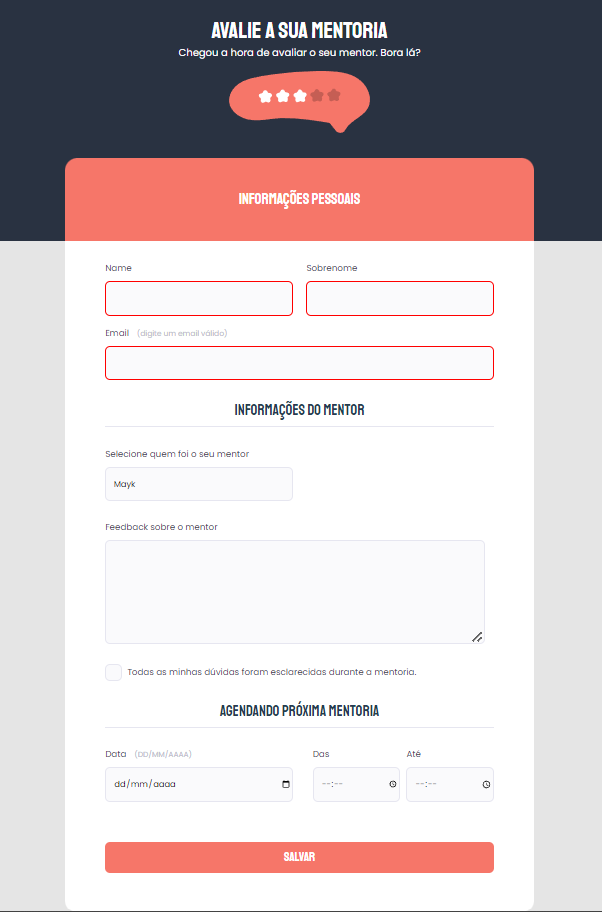

# Desafio 02 - Stage 03

> Explorer

### O desafio:
- Recriar um formulario, a partir de um layout disponível no Figma, para treinar todo o que aprendemos sobre formularios.

Nesse abordaremos:

- Campo select e a sua customização;
- Campo checkbox;
- Imagem centralizada no header.

[Clique aqui para acessar](https://danysglez.github.io/Explorer-Stage02-phase04/)

### Tecnologias utilizadas:

   
   

## 

  
  
   
  

